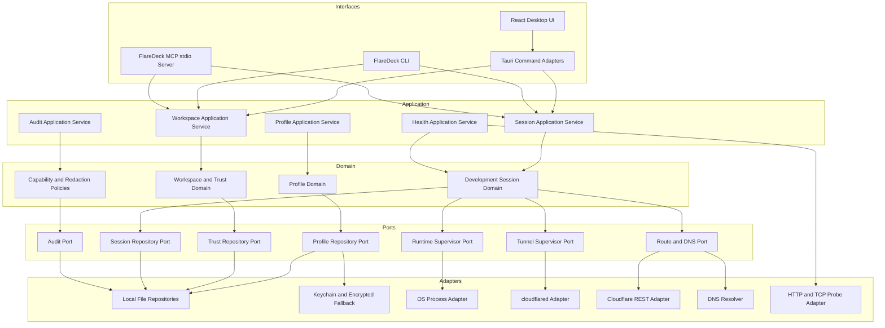
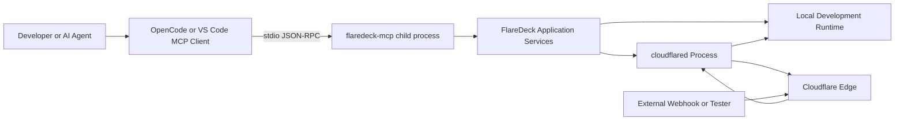
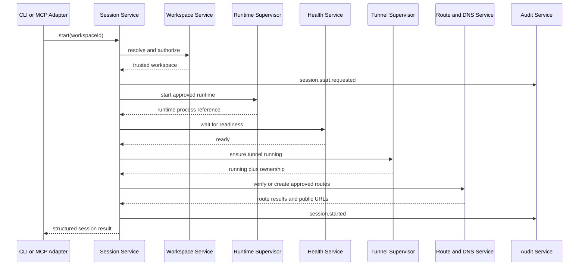

# Architecture: FlareDeck AI Development Integration

## 1. Architecture objective

The target architecture allows the existing Tauri desktop UI, a new CLI, and a new local MCP server to use one shared Rust implementation for profile, workspace, runtime, session, route, health, and audit behavior.

The architecture must remain local-first, cross-platform, testable without a desktop shell, and compatible with FlareDeck’s current profile, Cloudflare API, YAML, WSL, secret, and tunnel lifecycle behavior.

## 2. Current architecture summary

FlareDeck is a hybrid application:

- React, Zustand, and Tauri invocation form the interactive desktop control surface.
- Rust commands call the Cloudflare REST API for control-plane operations.
- The local `cloudflared` process provides the data plane.
- API tokens are stored through the OS keychain or a machine-bound encrypted fallback.
- Tunnel child processes are tracked per profile with log streaming and crashloop protection.

The enhancement must extract and reuse behavior rather than duplicate current Tauri command logic.

## 3. Target logical architecture



## 4. Dependency rule

Dependencies point inward:

```text
Interface adapters -> Application services -> Domain and ports
Infrastructure adapters -> Domain ports
```

The domain must not import:

- Tauri types;
- MCP SDK types;
- CLI argument types;
- React or TypeScript types;
- concrete filesystem paths;
- concrete Cloudflare HTTP client types.

## 5. Recommended repository evolution

### 5.1 Initial extraction inside the existing Rust package

Use this until shared behavior and boundaries are stable:

```text
src-tauri/src/
├── application/
│   ├── mod.rs
│   ├── workspace_service.rs
│   ├── session_service.rs
│   ├── profile_service.rs
│   ├── health_service.rs
│   └── audit_service.rs
├── domain/
│   ├── mod.rs
│   ├── workspace.rs
│   ├── trust.rs
│   ├── session.rs
│   ├── runtime.rs
│   ├── route.rs
│   └── audit.rs
├── ports/
│   ├── mod.rs
│   ├── repositories.rs
│   ├── runtime.rs
│   ├── tunnel.rs
│   ├── route.rs
│   └── probes.rs
├── adapters/
│   ├── mod.rs
│   ├── filesystem/
│   ├── process/
│   ├── cloudflare/
│   └── cloudflared/
├── interfaces/
│   ├── tauri/
│   ├── cli/
│   └── mcp/
├── bin/
│   ├── flaredeck.rs
│   └── flaredeck-mcp.rs
└── lib.rs
```

Existing modules should be migrated incrementally. Do not move every file in one refactor merely to produce an attractive tree.

### 5.2 Optional Cargo workspace

Split into crates only after one or more triggers occur:

- the desktop bundle should not compile MCP dependencies;
- CLI and MCP packaging need independent release artifacts;
- test compilation becomes materially slower;
- the shared core has stable public contracts;
- feature flags become harder to manage than separate crates.

Possible later structure:

```text
crates/
├── flaredeck-core/
├── flaredeck-infrastructure/
├── flaredeck-cli/
└── flaredeck-mcp/
apps/
└── desktop/
```

A Cargo workspace is an evolution option, not a Phase 1 objective.

## 6. Runtime topology



The MCP server does not expose a network listener. The AI client launches it as a subprocess and communicates through stdin/stdout. Diagnostics go to stderr only.

## 7. Application service responsibilities

### WorkspaceApplicationService

- locate and parse a manifest;
- normalize paths;
- validate schema and policy;
- calculate trust fingerprint;
- read trust status;
- request or revoke approval through a user-facing adapter;
- return a safe workspace view.

### SessionApplicationService

- enforce one active session per workspace;
- validate trust and capabilities;
- start the runtime;
- await readiness;
- start or observe the tunnel;
- verify routes and DNS;
- build public URLs;
- expose status and logs;
- stop and clean up idempotently;
- emit audit events.

### ProfileApplicationService

- wrap existing profile operations;
- preserve preflight-before-mutation behavior;
- expose safe profile selection information;
- never serialize token values.

### HealthApplicationService

- execute origin, readiness, DNS, route, and tunnel checks;
- aggregate observations into healthy, degraded, failed, or unknown;
- enforce target restrictions and response limits.

### AuditApplicationService

- normalize actor and correlation metadata;
- redact safe fields;
- append events;
- provide bounded query operations for the UI and CLI.

## 8. Process supervision architecture

Runtime and tunnel processes have similar concerns but different ownership and configuration. They must use separate supervisors behind a shared conceptual interface.

```text
ProcessSupervisor
├── DevelopmentRuntimeSupervisor
└── CloudflaredTunnelSupervisor
```

Shared concerns:

- spawn;
- process-tree termination;
- status;
- bounded logs;
- exit observation;
- crashloop policy;
- correlation metadata.

Different concerns:

- runtime executable comes from a trusted workspace manifest;
- tunnel executable and arguments come from FlareDeck profile configuration;
- a session may own the runtime but only observe an already-running tunnel;
- tunnel logs may be shared by multiple consumers.

## 9. Session start sequence



Failure at any step invokes compensation for only the resources created by that start attempt.

## 10. Storage architecture

### Existing data

Existing profile, YAML, tunnel credentials, keychain, encrypted fallback, and preference storage remain authoritative for current behavior.

### New safe state

Proposed files in the FlareDeck application data directory:

```text
workspaces.json
trust-approvals.json
active-sessions.json
logs/audit-YYYY-MM.jsonl
```

Implementation may use another safe local format, but must preserve:

- atomic writes;
- versioned schemas;
- backups or recovery on corruption;
- restrictive file permissions where supported;
- no secret values;
- migrations tested against older versions.

## 11. CLI architecture

The CLI is an interface adapter, not a separate daemon.

Responsibilities:

- parse arguments;
- construct an actor context;
- call application services;
- format human or JSON output;
- map errors to exit codes;
- write diagnostics to stderr;
- avoid ANSI output in JSON mode.

The CLI should be usable for local scripts even before MCP is implemented. This makes application behavior testable without introducing protocol complexity.

## 12. MCP architecture

The MCP adapter exposes tools only. Resources and prompts may be added later if they provide clear value.

MVP tool categories:

- workspace discovery and status;
- session start, status, stop;
- public URL retrieval;
- health checks;
- bounded log reads;
- environment doctor.

MCP requirements:

- stdio transport;
- stdout contains only valid protocol messages;
- stderr contains diagnostics;
- no raw secret inputs or outputs;
- no arbitrary paths beyond registered workspaces;
- no arbitrary commands;
- small schemas and bounded responses;
- structured error data;
- destructive or trust-sensitive operations remain policy-gated.

## 13. Frontend architecture

The desktop UI continues to call typed wrappers in `src/lib/tauriApi.ts`. New commands follow the existing five-place rule documented in `AGENTS.md`.

Recommended new Zustand slices or stores:

- workspace state;
- session state;
- health state;
- audit state.

Do not overload the existing active-profile state with workspace and session semantics. A workspace selects a profile, but the active desktop profile and the session’s bound profile are distinct concepts.

## 14. Security architecture

Security controls are layered:

1. schema validation;
2. canonical path validation;
3. local trust fingerprint and approval;
4. operation capability checks;
5. restricted process spawn without shell interpolation;
6. environment allowlisting;
7. secret containment;
8. output redaction;
9. bounded logs and responses;
10. audit events;
11. idempotent cleanup;
12. UI confirmation for trust or destructive changes.

The threat model is defined in `docs/security/THREAT-MODEL.md`.

## 15. Observability architecture

Each operation receives a correlation ID propagated through:

- interface request;
- application service;
- runtime and tunnel events;
- health checks;
- Cloudflare operations;
- audit records;
- returned result.

Logs use structured fields internally. User-facing output is safe and concise. Full debug logs must still apply redaction.

## 16. Testing architecture

### Unit tests

- domain invariants;
- manifest parsing and canonicalization;
- fingerprint stability;
- trust invalidation;
- state transitions;
- redaction;
- error mapping;
- schema generation or validation.

### Adapter tests

- filesystem repositories with temporary directories;
- process supervisor with fixture processes;
- Cloudflare client using mocked HTTP;
- MCP protocol framing and stdout discipline;
- CLI JSON snapshots.

### Integration tests

- start a local fixture server;
- wait for readiness;
- simulate or run a tunnel adapter;
- return public URL metadata;
- stop and confirm process cleanup;
- repeat operations to verify idempotency.

### Manual cross-platform tests

- Windows native;
- Windows plus WSL origin;
- Linux desktop and headless/keychain fallback;
- macOS;
- profile and route regression.

## 17. Deployment and packaging

MVP implementation may package CLI and MCP binaries with the desktop application or provide them as additional release artifacts. The chosen packaging must ensure:

- version compatibility between interfaces and local data schemas;
- clear executable discovery;
- signed artifacts where current release signing supports it;
- updater behavior does not leave mismatched binaries;
- `cloudflared` remains an external dependency unless a separate product decision changes it.

## 18. Evolution triggers

Move beyond the proposed architecture only when a measurable trigger exists:

- remote MCP: multiple machines or remote agents genuinely require it;
- Cargo workspace: compile or release separation has become costly;
- database storage: JSON atomic persistence is no longer adequate for event volume or concurrency;
- multiple sessions per workspace: isolated ports and route namespaces are implemented;
- background daemon: independent lifecycle outside desktop/CLI invocations is required;
- hosted service: a separate product and security model is approved.
