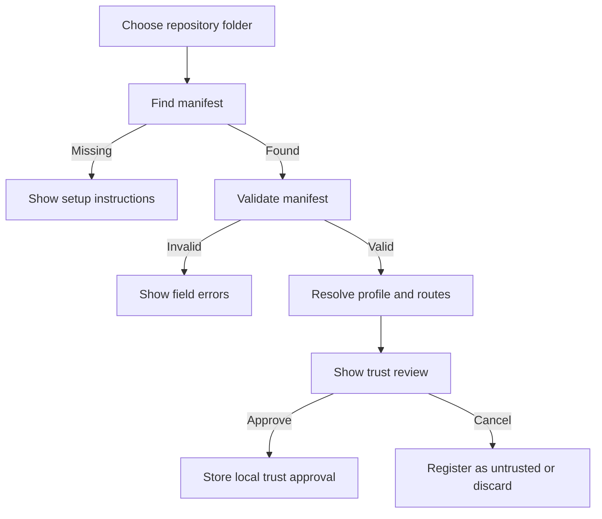
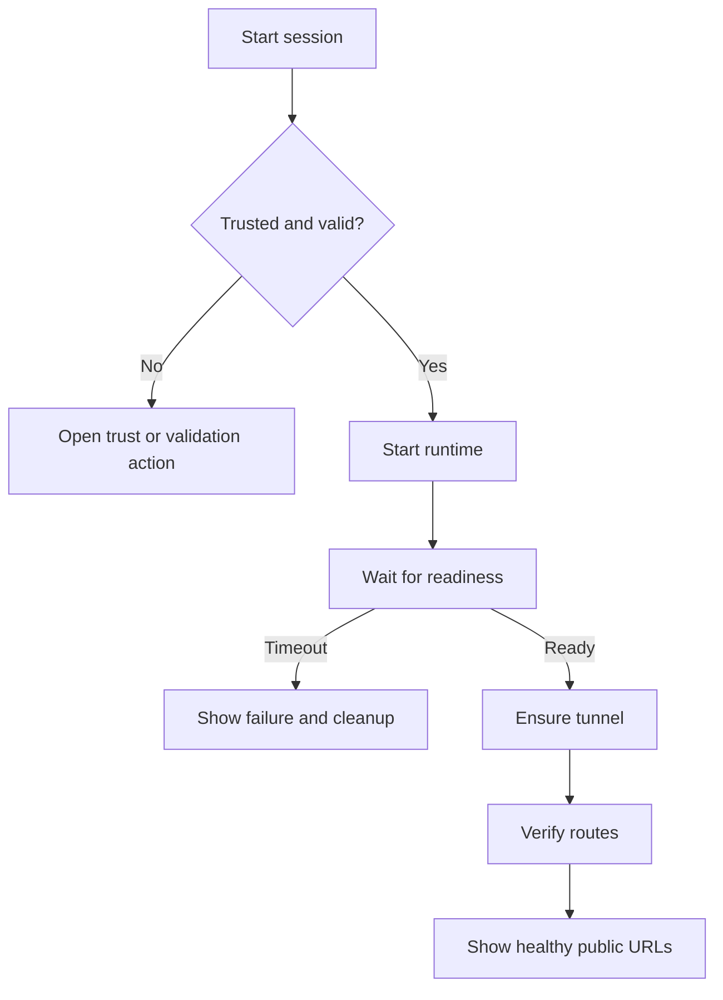

# Desktop Design: Workspace and Development Sessions

## 1. Design status

Implemented in Phase 7 over the stable application-service, CLI, workspace/session, and MCP contracts. Remaining pixel-level native desktop checks are tracked in `docs/implementation/PHASE-7-DESKTOP.md`.

## 2. Design objectives

- make workspace trust and runtime behavior understandable before execution;
- show the relationship between workspace, profile, runtime, tunnel, and public route;
- keep the current profile-first workflow available;
- expose status and logs without overwhelming the developer;
- make approval and destructive actions explicit;
- keep secret values invisible;
- support keyboard use and accessible status communication;
- preserve the existing FlareDeck visual system: Tailwind, shadcn/ui, Lucide icons, and current theme behavior.

## 3. Information architecture

Proposed primary navigation:

```text
Dashboard
Workspaces
Profiles
Configuration
Settings
```

The existing dashboard may evolve into a combined overview, but Profiles remain a first-class concept because they own Cloudflare tunnels and credentials.

## 4. Primary screens

## 4.1 Overview dashboard

Purpose: answer “what is running and exposed right now?”

Sections:

- active development sessions;
- tunnel status by profile;
- unhealthy or degraded checks;
- recent audit events;
- setup or trust actions requiring attention.

Each active-session card shows:

- workspace name;
- session state;
- bound profile;
- local origin;
- public URLs;
- runtime and tunnel indicators;
- session age;
- Start, Stop, View Logs, and Copy URL actions as applicable.

## 4.2 Workspace list

Columns or cards:

- workspace name;
- repository path summary;
- selected profile;
- validation status;
- trust status;
- current session status;
- last used;
- actions.

Filters:

- all;
- trusted;
- approval required;
- running;
- unhealthy;
- invalid manifest.

## 4.3 Workspace detail

Sections:

1. Summary
2. Runtime
3. Exposure routes
4. Readiness and health
5. Trust and permissions
6. Session history
7. Safe manifest preview

The page must visually distinguish:

- repository-declared values;
- locally approved values;
- current observed state;
- values derived by FlareDeck.

## 4.4 Trust review dialog

This is a security screen, not a ceremonial confirmation.

Show:

- canonical workspace path;
- executable and each argument;
- working directory;
- environment variable names, never values;
- safe literal environment values;
- readiness target;
- selected profile;
- hostnames and origins;
- lifecycle and cleanup behavior;
- differences from the previously approved fingerprint;
- capabilities requested.

Actions:

- Cancel;
- Trust this configuration;
- Trust until manifest changes;
- optionally trust until a date in a later phase.

Do not use an ambiguous “OK” button.

## 4.5 Session detail

Header:

- workspace;
- state badge;
- session ID shortened for display;
- correlation ID copy action;
- start time;
- Stop button.

Status pipeline:

```text
Validate -> Start runtime -> Readiness -> Tunnel -> Routes -> Healthy
```

Display completed, current, blocked, and failed stages.

Tabs:

- Overview;
- Logs;
- Health;
- Routes;
- Audit.

## 4.6 Combined logs

Features:

- runtime/tunnel/system source filters;
- level filters;
- bounded live tail;
- pause autoscroll;
- copy safe selection;
- correlation filter;
- clear local view without deleting audit records;
- redaction indicator.

Never expose a “show unredacted” action.

## 4.7 Health view

Checks:

- runtime process;
- readiness endpoint;
- origin TCP/HTTP;
- tunnel process;
- DNS resolution;
- route availability.

Each check shows:

- state;
- last checked;
- latency;
- safe detail;
- retry action when appropriate.

## 5. Core interaction flows

## 5.1 Add workspace



FlareDeck does not edit the project manifest automatically in the MVP.

## 5.2 Start session



## 5.3 Manifest changed

- show “Approval required” status;
- prevent automatic start;
- offer a diff-oriented trust review;
- preserve old approval as historical evidence but mark it inactive;
- do not silently update the approved fingerprint.

## 6. Visual status vocabulary

Use text plus icon, not color alone.

- `Not configured`
- `Validation required`
- `Approval required`
- `Ready`
- `Starting`
- `Waiting for readiness`
- `Healthy`
- `Degraded`
- `Stopping`
- `Stopped`
- `Failed`
- `Cleanup incomplete`

Avoid using “Connected” for every state. A profile API connection, tunnel process, runtime readiness, and public-route health are different facts.

## 7. Error design

Errors should include:

- plain-language problem;
- stable error code in expandable technical details;
- affected workspace/session;
- whether retry is safe;
- required action;
- correlation ID;
- links to safe logs or settings.

Example:

```text
Workspace approval required
The development command or exposure configuration changed since your last approval.
Review the changes before starting this workspace.

Code: WORKSPACE_TRUST_CHANGED
```

## 8. Confirmation policy

Require explicit confirmation for:

- trust approval;
- trust revocation;
- deleting a workspace registration;
- deleting temporary routes outside normal session cleanup;
- stopping a tunnel that existed before the session;
- retrying cleanup with wider effects.

Do not require confirmation for:

- read-only health checks;
- copying URLs;
- viewing redacted logs;
- stopping a runtime owned by the current session when the user presses Stop.

## 9. Accessibility

- all statuses have text labels;
- progress updates use appropriate live regions without excessive announcements;
- buttons have explicit accessible names;
- logs remain keyboard navigable;
- dialogs trap focus and restore it correctly;
- contrast follows the existing theme system;
- motion is reduced when user preference requests it;
- copy actions provide non-visual confirmation.

## 10. Responsive behavior

FlareDeck is a desktop application, but windows may be narrow.

- sidebar may collapse;
- status pipeline becomes vertical below a threshold;
- tables switch to stacked rows or horizontal scroll;
- primary Start/Stop actions remain visible;
- log source and level filters collapse into a popover;
- no essential security field is hidden behind hover-only UI.

## 11. Component map

Suggested components:

```text
WorkspaceList
WorkspaceCard
WorkspaceStatusBadge
WorkspaceTrustBadge
WorkspaceDetailHeader
RuntimeDefinitionCard
RouteSummaryTable
ReadinessCard
TrustReviewDialog
TrustDiff
SessionCard
SessionPipeline
SessionDetail
SessionControlBar
PublicUrlList
CombinedLogViewer
HealthCheckList
AuditEventList
SafeTechnicalDetails
```

Reuse shadcn primitives and existing FlareDeck components. Do not add another component library.

## 12. Frontend data requirements

UI views must receive safe display models, not raw domain or secret-bearing infrastructure types.

Examples:

```ts
interface WorkspaceDetailView {
  id: string;
  name: string;
  pathDisplay: string;
  profile: ProfileSummary;
  validation: ValidationSummary;
  trust: TrustSummary;
  runtime: SafeRuntimeSummary;
  routes: SafeRouteSummary[];
  activeSession: SessionSummary | null;
}
```

Paths may be fully visible to the local desktop user, but MCP uses a stricter output policy.

## 13. Design acceptance criteria

- a developer can distinguish workspace, profile, runtime, tunnel, and route states;
- trust review shows every behavior-affecting field included in the fingerprint;
- no secret values appear;
- session start progress and failure location are visible;
- cleanup ownership is understandable;
- degraded status does not incorrectly imply complete failure;
- keyboard and screen-reader behavior is verified;
- UI changes do not break existing profile-first workflows.
