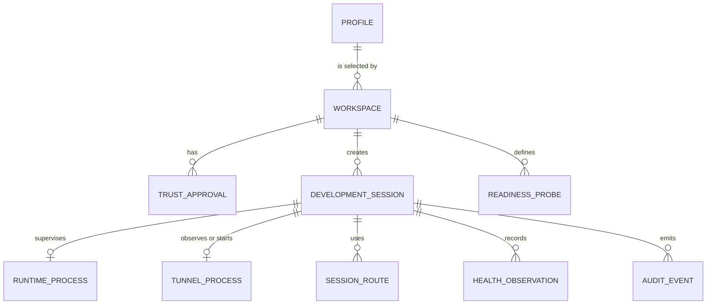
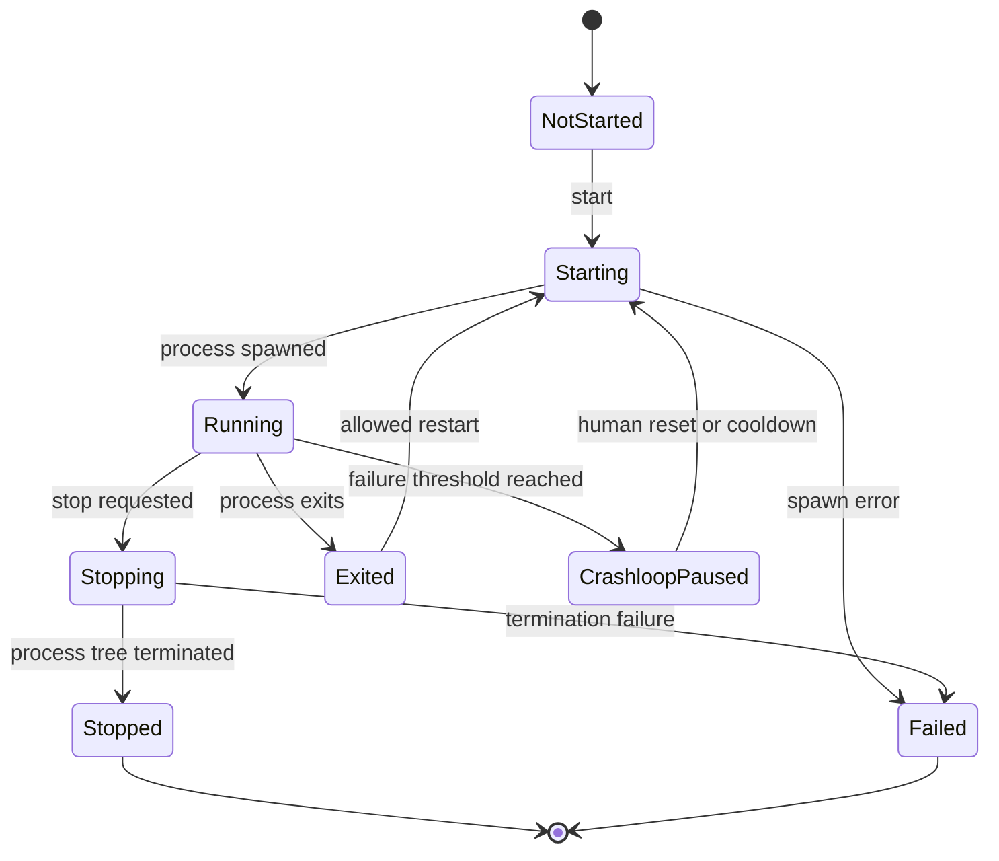
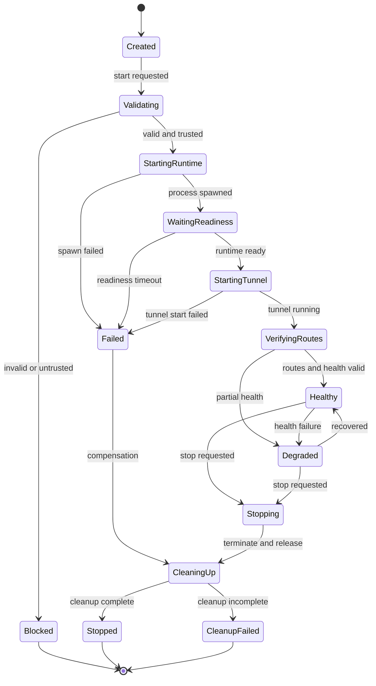

# Domain Model: FlareDeck AI Development Integration

## 1. Purpose

This document defines the terms, entities, aggregates, invariants, state transitions, and persistence boundaries for the enhancement. It prevents `profile`, `workspace`, `project`, `runtime`, `tunnel`, and `session` from becoming interchangeable words with incompatible implementations.

## 2. Bounded contexts

### 2.1 Cloudflare control context

Existing responsibilities:

- API token verification;
- account and zone lookup;
- named tunnel creation;
- tunnel credentials;
- DNS route creation;
- ingress configuration.

Primary aggregate: `Profile`.

### 2.2 Local development context

New responsibilities:

- workspace manifest discovery and validation;
- local trust approval;
- development runtime supervision;
- readiness checks;
- session orchestration;
- logs and health reporting.

Primary aggregates: `Workspace` and `DevelopmentSession`.

### 2.3 Interface context

Responsibilities:

- translate Tauri, CLI, and MCP requests into application commands;
- authorize operations against trust and capability policy;
- serialize stable response and error contracts;
- redact outputs.

This context contains adapters, not independent domain behavior.

## 3. Entity relationship overview

## 4. Core domain objects

## 4.1 Profile

An existing FlareDeck configuration representing exactly one Cloudflare Tunnel and exactly one API token identity.

### Identity

`ProfileId`, generated locally and stable.

### Important attributes

- display name;
- tunnel UUID;
- Cloudflare account ID;
- zone ID and zone name;
- tunnel configuration path;
- tunnel credentials path;
- API-token availability indicator;
- optional WSL origin behavior;
- profile lifecycle status.

### Invariants

1. One profile maps to one tunnel.
2. One profile maps to one token storage account.
3. Token values are never part of the serialized profile.
4. A workspace selects a profile; it does not own or duplicate it.
5. Deleting a workspace must not delete its selected profile.

## 4.2 WorkspaceManifest

A version-controlled declaration of how a local repository should be started and exposed.

### Identity

The manifest has no independent database identity. It is identified by its canonical path and schema version.

### Attributes

- schema version;
- project name;
- optional project ID;
- root path policy;
- runtime command and arguments;
- working directory;
- readiness probe;
- selected profile reference;
- routes;
- environment allowlist and safe literals;
- lifecycle policy;
- optional labels.

### Invariants

1. It contains no token, tunnel credential, password, private key, or secret value.
2. Relative paths resolve beneath the canonical workspace root.
3. The runtime command is represented as executable plus arguments, not an opaque shell string, unless a later ADR explicitly allows a platform shell mode.
4. Hostnames and origins must pass the same normalization and validation rules used by FlareDeck.
5. A manifest change produces a new trust fingerprint.

## 4.3 Workspace

A local, resolved, validated representation of a repository and its manifest.

### Identity

`WorkspaceId`, derived from a canonical root and optional manifest project ID. It must remain stable across application restarts on the same machine.

### Attributes

- canonical root;
- manifest path;
- parsed manifest;
- selected `ProfileId`;
- manifest digest;
- trust fingerprint;
- validation status;
- trust status;
- last observed time;
- optional display metadata.

### Invariants

1. The canonical root exists and is a directory.
2. The manifest path is within the canonical root.
3. Executable working directories are within the canonical root unless explicitly approved by a future policy.
4. A workspace cannot become runnable until validation and trust approval succeed.
5. Trust applies to a specific fingerprint, not merely to a path or project name.

## 4.4 TrustApproval

A local decision by a human user that a specific workspace configuration may execute.

### Identity

`TrustApprovalId` or compound key `(WorkspaceId, TrustFingerprint)`.

### Attributes

- workspace ID;
- approved fingerprint;
- approved timestamp;
- approving local user identity when available;
- approved capabilities;
- optional expiration;
- revocation timestamp and reason;
- safe summary of approved command, working directory, routes, and environment names.

### Invariants

1. Approval never comes from an MCP caller claiming that a human approved it.
2. Approval is invalid when the fingerprint changes.
3. Approval can be revoked without changing the repository.
4. Approval never stores secret values.
5. Capabilities may be narrower than the manifest requests.

## 4.5 RuntimeDefinition

A value object describing the approved development process.

### Attributes

- executable;
- argument list;
- working directory;
- safe environment literals;
- environment variable names allowed to pass through;
- startup timeout;
- stop timeout;
- restart policy;
- log cap.

### Invariants

1. No arbitrary command override is accepted at start time.
2. Environment passthrough is explicit.
3. The working directory remains under the workspace root.
4. Shell interpolation is disabled by default.
5. Runtime definition contributes to the trust fingerprint.

## 4.6 RuntimeProcess

A supervised local child process created from `RuntimeDefinition`.

### Identity

`RuntimeProcessId`, unique per process start.

### Attributes

- process ID when available;
- process-group or job identifier;
- state;
- start and stop timestamps;
- exit code;
- restart count;
- bounded stdout/stderr buffers;
- last failure summary.

### States

## 4.7 ReadinessProbe

A value object defining how FlareDeck decides that the runtime is usable.

### Supported MVP types

- TCP connect;
- HTTP GET.

### Attributes

- type;
- target host and port or URL;
- expected HTTP status range;
- timeout;
- interval;
- maximum attempts;
- optional safe headers without secrets.

### Invariants

1. Probe destinations must be local or explicitly approved.
2. Probe responses are size-limited.
3. Probe configuration contributes to the trust fingerprint.

## 4.8 DevelopmentSession

The aggregate coordinating one workspace exposure activity.

### Identity

`SessionId`, randomly generated and globally unique enough for local audit correlation.

### Attributes

- workspace ID;
- profile ID;
- actor;
- state;
- runtime process reference;
- tunnel relationship;
- active session routes;
- health summary;
- public URLs;
- correlation ID;
- start and stop timestamps;
- failure reason;
- cleanup status.

### Invariants

1. One active session per workspace by default.
2. A session cannot start unless the workspace is validated and trusted.
3. A session does not own the profile tunnel credentials.
4. A failed start must execute compensating cleanup for resources created by that attempt.
5. Stop and cleanup are idempotent.
6. Session output is redacted before crossing any interface boundary.

### State model

## 4.9 TunnelProcessReference

A session-level observation of the existing profile tunnel process.

The profile tunnel may already be running for another reason. Therefore the session records whether it:

- found the tunnel already running;
- started the tunnel;
- owns permission to stop it during cleanup;
- observed tunnel health;
- received tunnel logs.

A session must not stop a pre-existing tunnel unless policy explicitly allows it.

## 4.10 SessionRoute

A route used or created for a session.

### Attributes

- hostname;
- service origin;
- optional path pattern;
- source: persistent or temporary;
- creation ownership;
- DNS status;
- ingress status;
- expiration;
- cleanup state.

### Invariants

1. A session may delete only a route it created and owns.
2. Persistent routes are verified, not automatically removed.
3. Temporary routes require an explicit lifecycle policy.
4. Catch-all ingress semantics remain preserved.

## 4.11 HealthObservation

An immutable observation produced by readiness, origin, DNS, tunnel, or route checks.

### WebhookCapture bounded context

A webhook capture belongs to one owned temporary session route. It stores a bounded, pre-storage-redacted request projection: event/route IDs, time, method, redacted path and headers, supported redacted body, body state, response status, and redaction version. It never stores the forwarding response body, original secret fields, credentials, or environment values. Replay resolves the route's approved loopback origin from authoritative local ownership state; interfaces cannot provide a target, headers, or body.

### Attributes

- check type;
- target identifier without secret query values;
- state;
- latency;
- timestamp;
- safe message;
- correlation ID.

## 4.12 AuditEvent

An append-only safe record of a control-plane action.

### Attributes

- event ID;
- timestamp;
- actor type and identifier;
- operation;
- workspace ID;
- session ID;
- profile ID when relevant;
- correlation ID;
- result;
- safe metadata;
- error code;
- redaction version.

### Invariants

1. No secret or tunnel credential content.
2. No unrestricted process environment.
3. No raw request body from webhook inspection unless separately redacted and governed.
4. Audit failure must not silently permit a mutating action when audit is required by policy.

## 5. Actor model

Supported actor types:

- `desktop_user`;
- `cli_user`;
- `mcp_client`;
- `system_recovery`;
- `test_harness`.

Actor identity is descriptive and not equivalent to strong authentication in the local MVP. Trust authorization remains based on local approval and operation policy.

## 6. Aggregate boundaries

### Profile aggregate

Owns Cloudflare identity, tunnel identity, secret references, and persisted profile configuration.

### Workspace aggregate

Owns manifest resolution, validation, fingerprint, and trust relationship.

### DevelopmentSession aggregate

Owns orchestration state, runtime reference, route ownership, health summary, and cleanup outcome.

Application services may coordinate these aggregates. Domain objects must not directly call Tauri, MCP, React, or CLI serialization code.

## 7. Domain services

- `WorkspaceDiscoveryService`
- `WorkspaceValidationService`
- `TrustPolicyService`
- `RuntimeSupervisor`
- `ReadinessService`
- `TunnelSupervisor` adapter over existing behavior
- `RouteService`
- `SessionOrchestrator`
- `HealthService`
- `AuditService`
- `RedactionService`

## 8. Repository interfaces

- `ProfileRepository`
- `WorkspaceRegistry`
- `TrustApprovalRepository`
- `SessionRepository`
- `AuditEventRepository`

Repositories expose domain objects and do not leak Tauri state or JSON file layout into domain services.

## 9. Persistence guidance

### Existing files retained

- profile index;
- per-profile tunnel YAML;
- tunnel credential files;
- secret fallback file.

### New local files proposed

Under the FlareDeck application data directory, not the repository:

- workspace registry containing safe canonical references;
- trust approvals keyed by fingerprint;
- recoverable active-session metadata;
- bounded audit log or rotating event files.

The repository contains only `.flaredeck/project.yaml` and optional project documentation.

## 10. Trust fingerprint

The fingerprint must be derived from a canonical serialization of security-relevant fields, including:

- schema version;
- canonical workspace root identity;
- executable and arguments;
- working directory;
- environment passthrough names;
- safe environment literals;
- readiness definition;
- selected profile;
- routes;
- lifecycle and cleanup policy.

Display-only labels should not invalidate trust unless they alter behavior.

## 11. Domain error categories

- validation error;
- trust required;
- capability denied;
- conflict or already running;
- not found;
- process start/stop failure;
- readiness failure;
- tunnel failure;
- route or DNS failure;
- cleanup failure;
- persistence failure;
- protocol or serialization failure;
- internal invariant violation.

Each category maps to stable technical error codes defined in `TECHNICAL.md`.

## 12. Evolution rules

1. New interface adapters may be added without changing domain semantics.
2. New readiness probe types require validation, SSRF analysis, and an ADR if they can reach non-local networks.
3. Remote MCP requires a new authentication and network threat model and is not an extension of the local stdio assumption.
4. Multiple concurrent sessions per workspace require an ADR covering port, route, process, and cleanup isolation.
5. A webhook inspector becomes a separate bounded context and must not be hidden inside the core session aggregate.
