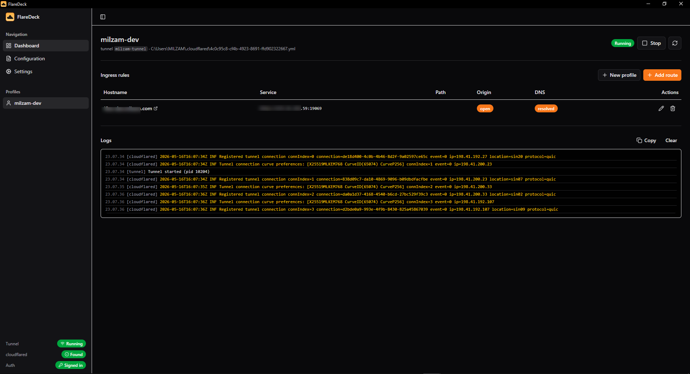
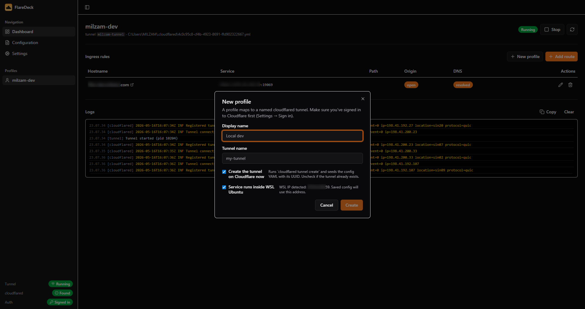

# FlareDeck

[](LICENSE)
[](https://tauri.app/)
[](https://react.dev/)
[](https://developers.cloudflare.com/cloudflare-one/connections/connect-networks/)

FlareDeck is a desktop control panel for local Cloudflare Tunnel development.
Paste a Cloudflare API token and a domain, click Create — FlareDeck spins up
the tunnel, wires up DNS, and watches the live logs. One profile = one tunnel
= one token.

Built with Tauri v2, Rust, React 19, Vite, Tailwind CSS v4, shadcn/ui, and
Zustand.

## Screenshots





## Why FlareDeck?

Cloudflare Tunnel is great for publishing local services, but day-to-day
development means juggling YAML, shell commands, DNS routing, the `cloudflared`
CLI, and tail logs. FlareDeck collapses that into a wizard:

1. **Create profile** → paste token, type a domain.
2. **Add route** → hostname + local origin URL.
3. **Start** → watch the tunnel come up in the log pane.

FlareDeck is hybrid: the **control plane** (zone lookup, tunnel creation, DNS
records) goes through the Cloudflare REST API with your per-profile token; the
**data plane** (actually running the tunnel) is the local `cloudflared` binary
spawned as a child process and supervised with crashloop protection, log
streaming, and platform-correct termination.

Use it when you want to:

- Spin up multiple tunnels from one app, each tied to its own account if needed.
- Skip `cloudflared tunnel login` — the API token handles auth.
- Skip hand-writing ingress YAML.
- Bridge Windows desktop development to services running inside WSL Ubuntu
  (loopback gets rewritten to the WSL VM IP automatically).
- Keep live `cloudflared` logs visible while you iterate.

## Features

### Core flow

- **One-shot profile wizard**: name + token + domain. FlareDeck does the rest
  via `POST /accounts/.../cfd_tunnel`, writes the credentials JSON cloudflared
  expects, and seeds the ingress YAML.
- **Reuse-token dropdown** — second profile? Pick the token from another
  profile instead of re-pasting.
- **Domain → IDs** automatically: FlareDeck calls `/zones?name=...`, walking
  subdomains down to the apex (`api.example.com` → `example.com`) until it
  finds a match.
- **Pre-flight scope check** before mutating any state — if your token lacks
  `Cloudflare Tunnel: Edit`, you get a clear error and zero leftover files.

### Run & manage

- **Per-profile tunnel processes** with start / stop / restart and concurrent
  multi-profile support.
- **Live `cloudflared` logs** streamed into the app.
- **Crashloop protection** — three failures in 30s pauses auto-start so a
  misconfigured tunnel doesn't spin.
- **Ingress rules** in a typed form; FlareDeck appends the catch-all rule.
  Path filtering tucked under an Advanced disclosure.
- **DNS routing** via Cloudflare API (`cf_route_dns`) when the profile has a
  token, falling back to `cloudflared tunnel route dns -f` otherwise.

### Operational

- **Tokens never on disk in plaintext.** Primary: OS keychain (Keychain on
  macOS, Credential Manager on Windows, Secret Service on Linux). Fallback on
  WSL or headless Linux: machine-keyed ChaCha20-Poly1305 encrypted file at
  `~/.cloudflared/flaredeck.secrets`.
- **WSL host rewrite** — for profiles flagged "service runs inside WSL", a
  `localhost:N` origin in the saved YAML becomes `<wsl-vm-ip>:N` so
  Windows-side cloudflared can reach it.
- **Origin port and DNS checks** in the dashboard table (`tokio::net::TcpStream`
  + `hickory-resolver`).
- **System tray** with show/quit, minimize-to-tray preference, first-close
  prompt to set the default.
- **Sidebar API status badge** that turns green when the active profile is
  connected; click it to jump to the credentials card.

## Requirements

- **`cloudflared` binary** installed and on `PATH` (or in a common install
  location FlareDeck auto-detects). FlareDeck does *not* bundle cloudflared.
  Get it from [Cloudflare's downloads page](https://developers.cloudflare.com/cloudflare-one/connections/connect-networks/downloads/).
- **A Cloudflare account** with at least one domain you control.
- **A Cloudflare API token** with these scopes:
  - `Account → Cloudflare Tunnel: Edit`
  - `Zone → Zone: Read`
  - `Zone → DNS: Edit`

  The New Profile dialog has a "Create token on Cloudflare ↗" link that
  pre-fills these. The dashboard sometimes drops the prefill — the dialog also
  lists the required scopes inline so you can verify.

## Install

### Pre-built binaries

Grab the platform-appropriate artifact from [Releases](#) (planned).

### Build from source

```bash
git clone https://github.com/<your-fork>/flaredeck.git
cd flaredeck
npm install
npm run desktop          # dev shell
# or
npm run desktop:build    # produces a platform bundle in src-tauri/target/release/bundle/
```

Requirements: Node 20+, Rust 1.76+ (stable), platform Tauri prerequisites
([see Tauri docs](https://tauri.app/start/prerequisites/)).

### Cross-compile to Windows from WSL

Useful if you develop on Linux/WSL and want a `.exe` without switching shells.
One-time setup:

```bash
sudo apt-get install -y lld clang nsis
cargo install cargo-xwin --locked
rustup target add x86_64-pc-windows-msvc
```

Then build:

```bash
PATH="/usr/lib/llvm-18/bin:$PATH" \
  pnpm tauri build --runner cargo-xwin --target x86_64-pc-windows-msvc
```

Outputs:

- `src-tauri/target/x86_64-pc-windows-msvc/release/flaredeck.exe` — standalone executable.
- `src-tauri/target/x86_64-pc-windows-msvc/release/bundle/nsis/FlareDeck_<version>_x64-setup.exe` — NSIS installer (handles WebView2 bootstrap on first install).

The `PATH` prefix makes `cc-rs` find unsuffixed `llvm-lib`/`llvm-rc` for the
`ring` crate build.

## First-Run Flow

1. Launch FlareDeck.
2. Sidebar bottom-left will show **`API: Not configured`** until you make a profile.
3. Click the **+ next to "Profiles"** in the sidebar (or the empty-state CTA on the Dashboard).
4. **New profile** dialog:
   - **Display name** — local label, e.g. `local-dev`.
   - **Cloudflare API token** — click "Create token on Cloudflare ↗" to get a
     pre-scoped one, paste the secret. Tokens are stored in the OS keychain.
   - **Domain** — any domain in your Cloudflare account. Subdomains work — we
     walk up to the apex.
   - **Service runs inside WSL Ubuntu** (Windows only) — turn on if your
     origin lives in WSL.
5. Click **Create profile**. FlareDeck creates the tunnel via API, writes
   the YAML + credentials, and selects the new profile.
6. **Add route** for each hostname → local origin pair you want to publish.
   Cloudflare DNS record is created automatically.
7. Click **Start**. The tunnel comes up; live logs stream into the log pane.

## Architecture

```
src/
├── main.tsx                  React entrypoint
├── router.tsx                Dashboard / Config / Settings routes
├── store/app-store.ts        Zustand store + async workflows
├── lib/
│   ├── tauriApi.ts           Typed boundary to Rust commands;
│   │                         routeDnsForProfile, normaliseDomainInput,
│   │                         CF_TOKEN_CREATE_URL.
│   ├── yaml-helpers.ts       Ingress parsing/serialization, WSL host rewrite
│   ├── i18n.ts               English locale
│   └── utils.ts              shadcn cn()
├── components/
│   ├── ui/                   shadcn primitives
│   ├── app-sidebar.tsx       Sidebar + Profiles list + "+" trigger + API status
│   ├── log-viewer.tsx        Live cloudflared log pane
│   ├── proxy-table.tsx       Ingress rules table
│   └── proxy-form-dialog.tsx Add/edit route (path under Advanced)
└── pages/
    ├── Dashboard.tsx         Active profile detail + NewProfileDialog
    ├── Config.tsx            CodeMirror YAML editor
    └── Settings.tsx          cloudflared install, WSL, profiles list,
                              CredentialsCard, window prefs, theme

src-tauri/
├── Cargo.toml
├── tauri.conf.json
├── capabilities/
└── src/
    ├── lib.rs                App setup, tray, single-instance,
    │                         tauri::generate_handler! registrations
    ├── cf_api.rs             CfClient — Cloudflare REST surface:
    │                         verify_token, lookup_zone_by_domain,
    │                         preflight_cfd_tunnel_scope, create_tunnel,
    │                         upsert_dns_route + scope-aware error hints
    ├── cloudflared.rs        cloudflared binary discovery + cert.pem
    ├── secrets.rs            Per-profile API tokens (keychain + encrypted file fallback)
    ├── state.rs              Runtime child-process map
    ├── error.rs              AppError, AppResult
    ├── types.rs              Shared serde payloads
    └── commands/
        ├── cf.rs             cf_route_dns, cf_lookup_zone,
        │                     create_tunnel_with_files (internal)
        ├── config.rs         config_get, config_save, write_initial_config
        ├── dns.rs, network.rs, prefs.rs, shell.rs, wsl.rs
        ├── profiles.rs       profiles_list/update/delete/set_active/
        │                     set_token/clear_token/verify_token/create_simple
        └── tunnel.rs         cloudflared_check, tunnel_status/start/stop/
                              restart, tunnel_route_dns (CLI fallback)
```

### On-disk runtime layout

- `~/.cloudflared/flaredeck.json` — profile index (no secrets).
- `~/.cloudflared/<profile-id>.yml` — cloudflared config per profile.
- `~/.cloudflared/<tunnel-uuid>.json` — cloudflared tunnel credentials.
- `~/.cloudflared/cert.pem` — origin cert from `cloudflared tunnel login`.
  Only created if you ever run `cloudflared tunnel login` manually; FlareDeck's
  wizard doesn't require it.
- `~/.cloudflared/flaredeck.secrets` — encrypted-file fallback for API tokens,
  created only when the OS keychain is unavailable.

## Privacy & Security

- API tokens live in the **OS keychain** (or encrypted-file fallback). They
  are never written to `flaredeck.json` and never logged.
- The encrypted-file fallback uses ChaCha20-Poly1305 with a key derived from a
  stable machine identifier (`/etc/machine-id`, `IOPlatformUUID`,
  `MachineGuid`). The file does **not** decrypt on a different machine. This
  protects against accidental sharing (e.g. backups), not against a local
  attacker with read access to your home directory — for that scenario use a
  machine with a working OS keychain.
- FlareDeck reads and writes only files under `~/.cloudflared/` plus its own
  prefs file. It does not auto-update, phone home, or share telemetry.
- Live `cloudflared` logs are kept only in-memory in the log viewer, capped at
  200 lines per profile.
- Treat `~/.cloudflared/<uuid>.json` (tunnel credentials) as sensitive — losing
  one lets anyone impersonate the tunnel until you rotate it from Cloudflare.

## Verification

Common checks:

```bash
npm run lint
npm run build
cargo check  --manifest-path src-tauri/Cargo.toml
cargo clippy --manifest-path src-tauri/Cargo.toml --all-targets -- -D warnings
cargo test   --manifest-path src-tauri/Cargo.toml --lib cf_api::
```

For UI-only changes, `npm run dev` and visit `http://localhost:5173`. Note
that Tauri commands no-op outside the desktop shell (`isTauri()` gate), so the
full wizard needs `npm run desktop` or a packaged build.

## Contributing

Contributions welcome. Before opening a PR:

- Read [AGENTS.md](AGENTS.md) — it documents the architecture, the
  five-place rule for Tauri commands, and the Cloudflare scope expectations.
- Keep changes scoped to one concern. Don't churn unrelated files.
- If you touch a Cloudflare API endpoint, update `hint_for(ApiCall, errors)`
  in `cf_api.rs` so error messages stay actionable.
- Run the verification commands above for the area you changed.
- Don't commit build output: `dist/`, `dist-windows/`, `src-tauri/target/`.

## License

FlareDeck is open source under the [MIT License](LICENSE).
