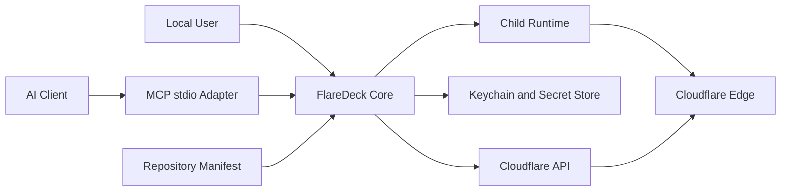

# Threat Model: FlareDeck AI Development Integration

## 1. Scope

This threat model covers the local desktop application, CLI, MCP stdio server, workspace manifest, trust store, development runtime supervision, Cloudflare Tunnel coordination, routes, logs, health checks, and local audit data.

It does not cover a remote MCP service, hosted FlareDeck control plane, enterprise multi-user authorization, or production deployment.

## 2. Assets

Highest sensitivity:

- Cloudflare API tokens;
- tunnel credential JSON files;
- OS keychain records and encrypted fallback;
- local source code and repository files;
- development environment secrets loaded by child applications;
- ability to execute a local process;
- DNS and tunnel configuration authority.

Operational sensitivity:

- workspace paths;
- process logs;
- public development URLs;
- session and audit records;
- webhook payloads in future Phase 8.

## 3. Trust boundaries

Important boundaries:

- AI client to MCP;
- repository content to trusted execution;
- FlareDeck to child process;
- FlareDeck to secret storage;
- FlareDeck to Cloudflare API;
- public internet to exposed development service.

## 4. Threat actors

- malicious or compromised repository;
- prompt-injected or misbehaving AI agent;
- malicious local process under the same user;
- user accidentally approving unsafe behavior;
- attacker with access to copied backups;
- external caller reaching the public development URL;
- dependency or MCP SDK compromise;
- local attacker with full account access, which cannot be completely mitigated by this application.

## 5. Threats and controls

## T-001 Arbitrary command execution through MCP

**Scenario:** agent supplies a command or shell fragment.

**Controls:**

- no generic shell tool;
- no command override in session start;
- executable and args come from validated manifest;
- direct process spawn without shell;
- trust fingerprint includes executable and args;
- command change invalidates trust.

## T-002 Malicious repository manifest

**Scenario:** cloned repository declares destructive command, path escape, secret access, or unexpected routes.

**Controls:**

- repository is untrusted by default;
- canonical path validation;
- human trust review with exact behavior;
- capability policy narrower than manifest intent;
- environment allowlist;
- local-only readiness targets;
- trust revocation and fingerprint invalidation.

## T-003 Prompt injection asks agent to reveal secrets

**Scenario:** repository content instructs agent to call tools that return tokens or environment values.

**Controls:**

- no secret-returning tools exist;
- secret subsystem exposes operations, not raw values;
- outputs are redacted;
- MCP cannot read `.env`;
- audit records tool use safely.

## T-004 Path traversal or workspace escape

**Scenario:** manifest working directory or executable path points outside repository.

**Controls:**

- canonical root and descendant checks;
- platform-specific path tests;
- reject symlink escape according to final policy;
- MCP accepts registered workspace selector, not arbitrary path.

## T-005 Environment leakage

**Scenario:** FlareDeck returns inherited environment or logs secrets.

**Controls:**

- explicit passthrough names;
- no environment-value introspection in outputs;
- redaction service;
- sensitive key-name rules;
- bounded logs;
- child application remains responsible for its own logging hygiene.

## T-006 Secret leakage through logs or errors

**Controls:**

- centralized redaction before interface serialization;
- safe error details;
- no raw HTTP headers or credential files;
- test canary secrets across error paths;
- diagnostics to stderr still pass redaction.

## T-007 Unintended DNS or route mutation

**Scenario:** agent creates or deletes unrelated records.

**Controls:**

- routes must originate in trusted manifest;
- validate selected profile zone;
- route ownership metadata;
- persistent route deletion prohibited during normal cleanup;
- temporary route operations added only in Phase 8;
- Cloudflare endpoint allowlist inside adapter.

## T-008 Stopping unrelated processes

**Controls:**

- session process ownership;
- process-group or job tracking;
- cautious PID recovery to avoid PID reuse;
- no arbitrary process-kill tool;
- pre-existing tunnel protected by ownership rules.

## T-009 MCP protocol confusion or stdout injection

**Controls:**

- protocol output only on stdout;
- diagnostics only on stderr;
- SDK-driven framing;
- tests capturing both streams;
- child runtime logs never forwarded directly to MCP stdout.

## T-010 Denial of service through unbounded logs or checks

**Controls:**

- log line and byte caps;
- bounded lists and result payloads;
- per-operation timeout;
- readiness attempt limits;
- cancellation;
- crashloop protection;
- one active session per workspace.

## T-011 Public exposure of unsafe development service

**Controls:**

- explicit trusted route declaration;
- clear UI showing public exposure;
- optional future Cloudflare Access integration requires separate scope/design;
- stop and cleanup workflow;
- warnings when binding applications to broad interfaces;
- documentation that FlareDeck does not authenticate the exposed application.

## T-012 Tampered local state

**Controls:**

- versioned schemas;
- atomic writes;
- restrictive permissions where possible;
- fail closed on unreadable trust state;
- migration tests;
- do not treat state files as secret containers.

## T-013 Dependency compromise

**Controls:**

- minimize new dependencies;
- lockfiles;
- review MCP SDK and process crates;
- CI security scanning where practical;
- signed release artifacts and checksums in Phase 9.

## 6. Trust assumptions

- the local OS user controls the machine;
- the OS keychain is preferred when available;
- the encrypted fallback protects accidental sharing, not a local attacker with account access;
- the user reviews trust dialogs honestly;
- Cloudflare and `cloudflared` are external trusted dependencies;
- AI client permission settings may be unsafe, so FlareDeck enforces its own policy regardless of client auto-approval.

## 7. Security acceptance tests

- untrusted workspace start denied in desktop, CLI, and MCP;
- changed command invalidates trust;
- `..`, symlink, Windows drive, UNC, and WSL path escape cases tested;
- shell metacharacters remain arguments and are not interpreted;
- canary token absent from stdout, stderr, audit, errors, and snapshots;
- arbitrary property rejected by MCP schemas;
- runtime timeout cancels and cleans up;
- repeated stop cannot kill unrelated process;
- pre-existing tunnel remains running;
- oversized logs are truncated;
- readiness redirect to external host rejected;
- corrupt trust state fails closed.

## 8. Future threat-model updates required

Update or create a separate model before:

- remote MCP or HTTP transport;
- webhook body capture and replay;
- Cloudflare Access automation;
- multi-user mode;
- multiple sessions per workspace;
- hosted service;
- secret injection or secret-manager integration;
- plugin system or arbitrary hooks.
