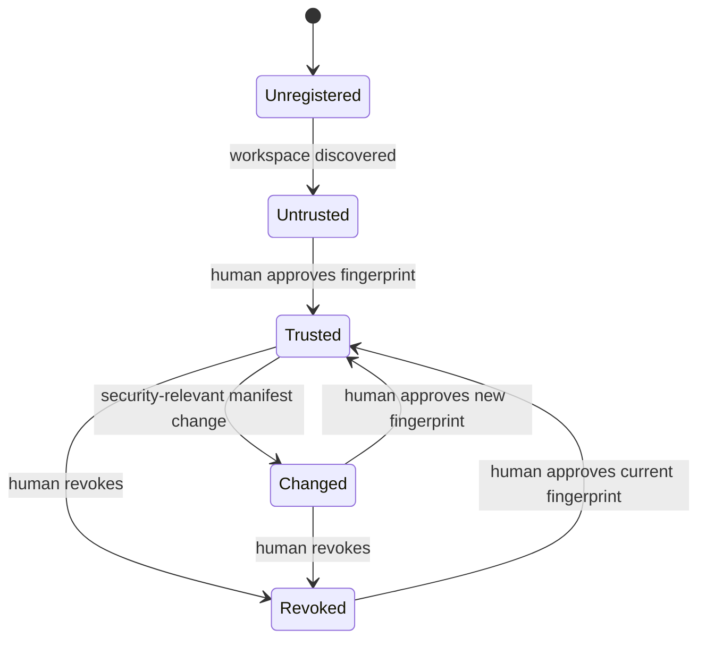

# Workspace Trust and Approval Model

## 1. Purpose

Trust approval authorizes FlareDeck to execute a specific, reviewed workspace configuration. It is not a statement that every file in the repository is safe, nor is it delegated to an AI agent.

## 2. Trust lifecycle

## 3. Security-relevant fields

Include in fingerprint:

- manifest schema version;
- canonical workspace identity;
- executable and arguments;
- working directory;
- environment passthrough names and committed values;
- readiness target and limits;
- selected profile;
- hostnames, service origins, and paths;
- lifecycle and cleanup flags;
- requested capabilities.

Exclude only display fields that cannot alter behavior.

## 4. Approval display

The user must see:

- repository path;
- executable and separated arguments;
- working directory;
- route hostnames and origins;
- selected profile and zone;
- environment names and safe committed literals;
- readiness check;
- process and cleanup behavior;
- differences from previous approval;
- warnings such as script execution or broad network binding.

## 5. Approval storage

Store locally outside the repository:

- workspace ID;
- fingerprint version and digest;
- approved capabilities;
- timestamp;
- safe reviewed summary;
- optional expiration;
- revocation metadata.

Never store secrets.

## 6. Approval sources

Allowed:

- desktop trust review;
- future interactive human CLI flow after a dedicated ADR.

Not allowed:

- MCP tool;
- manifest flag like `trusted: true`;
- environment variable bypass;
- hidden development mode;
- AI-generated assertion that approval occurred.

## 7. Capability examples

- execute declared runtime;
- ensure selected tunnel is running;
- verify persistent routes;
- create temporary routes when Phase 8 is approved;
- stop session-owned runtime;
- stop session-started tunnel;
- read redacted logs.

Policy may approve fewer capabilities than requested.

## 8. Fail-closed behavior

Start is denied when:

- approval is missing;
- fingerprint differs;
- trust store is unreadable;
- required capability is absent;
- selected profile changed;
- manifest validation changed behavior through defaults in an incompatible schema version.
